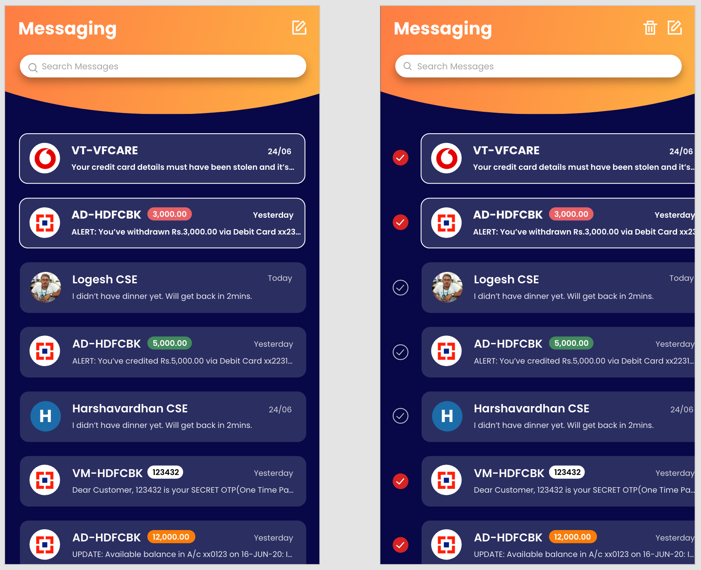
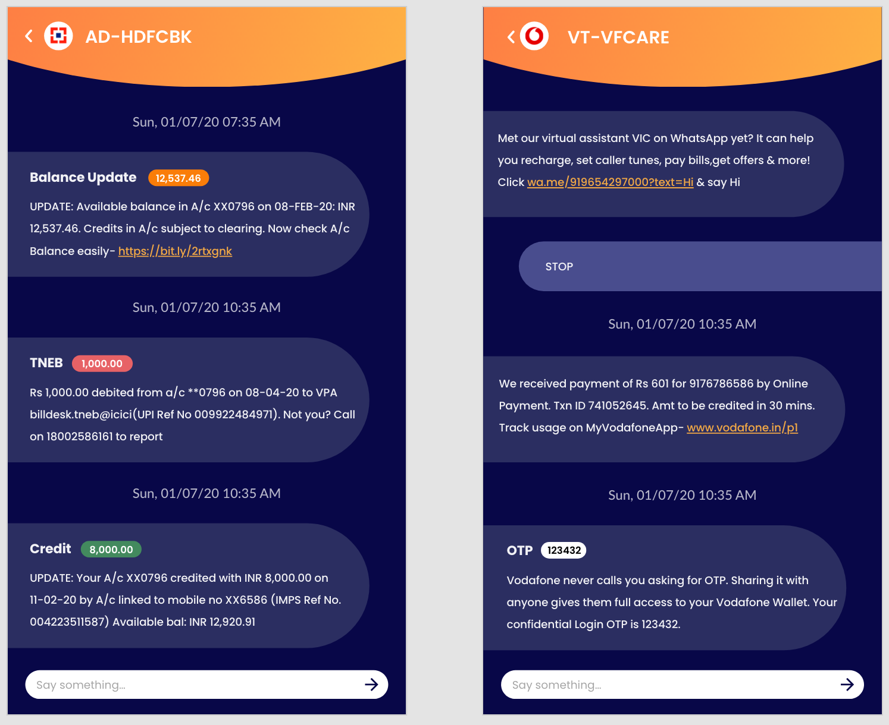
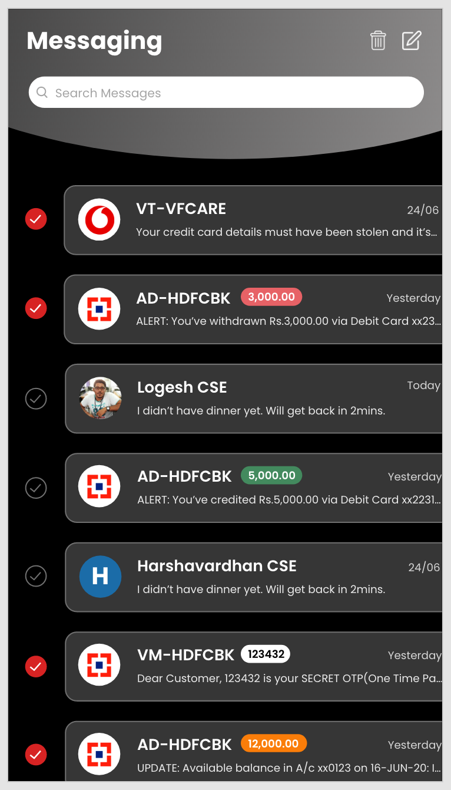

# SMS Messaging app

* No Internet required (No need to worry about privacy)
* Customized UI themes
* Dark mode

# Samples

# Issues
* Custom notification builder for different types of SMS.
* Notification badge for different mobile models.

# Contributions 

PRs are welcome! Please send a PR with detailed description of changes. It may be UI improvements or issues or enhancements.
